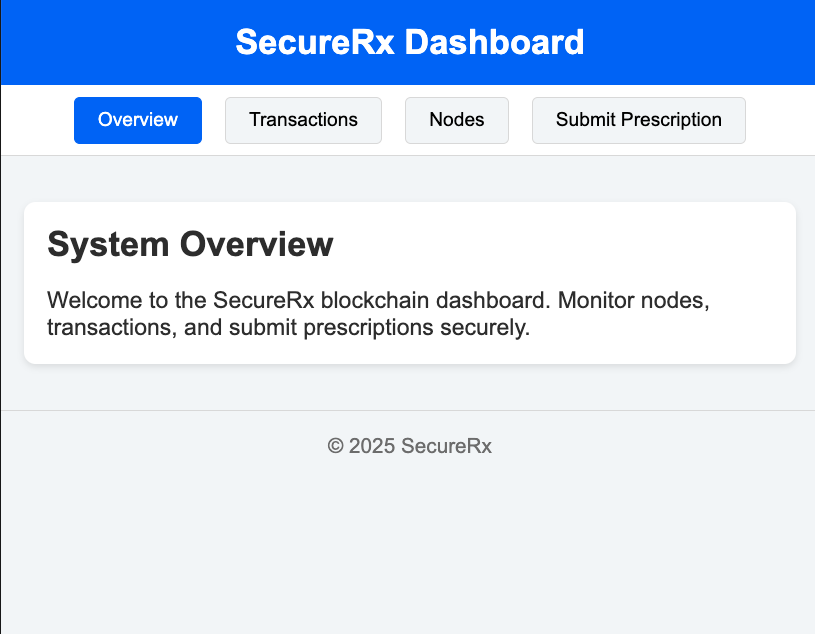
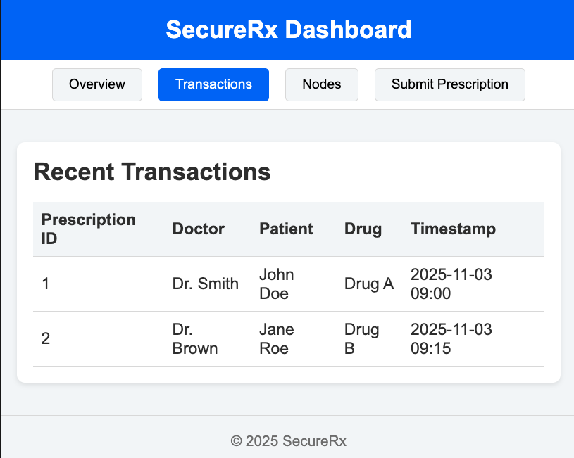
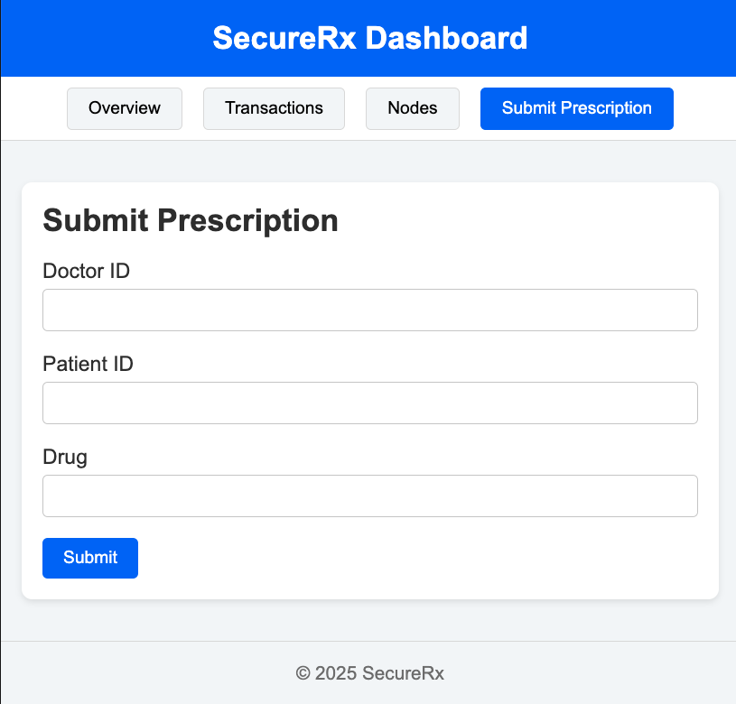
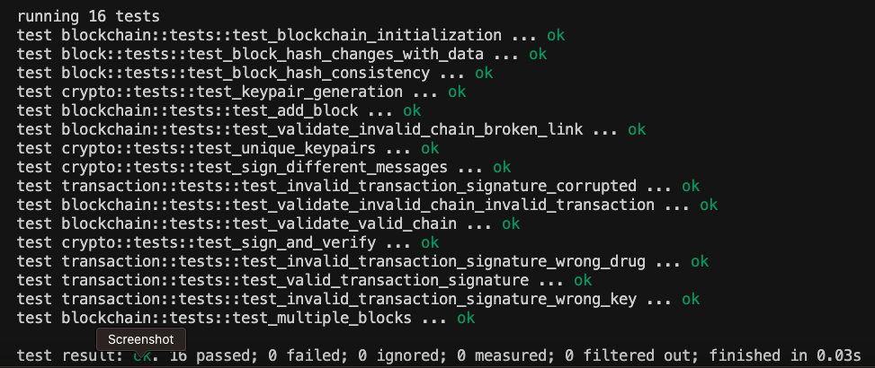

# 🚀 SecureRx — Blockchain Prescription Management

[](https://www.rust-lang.org/) 
[](LICENSE) 
[](https://github.com/asearer/securerx/actions) 
[](https://www.docker.com/)
[](https://github.com/asearer/securerx/actions)

---

## 🔹 The Next-Gen Prescription Platform

**SecureRx** is a **secure, blockchain-based prescription management system** designed to:

* ✅ **Eliminate prescription fraud**  
* ✅ Ensure **immutable, auditable, and verifiable prescriptions**  
* ✅ Provide **real-time monitoring** and operational transparency  

Built for **hospitals, pharmacies, and regulators**, SecureRx combines **Rust-powered blockchain cores**, **multi-node consensus**, and a **modern React + Vite frontend** to deliver **production-ready resilience and security**.

---

### 🔹 Why SecureRx?

| Feature | Benefit |
|---------|--------|
| **Permissioned Blockchain** | Tamper-proof prescription records |
| **Cryptographically Signed Transactions** | Verified doctor authenticity |
| **Multi-node Consensus** | Decentralized and reliable |
| **Monitoring & Alerts** | Detect anomalies in real-time |
| **Dockerized Deployment** | Scalable & production-ready |
| **Frontend GUI** | Modern, user-friendly interface |

---

## 🎬 GUI Screenshots & Test Results

<p align="center">
  <figure style="display:inline-block; margin:10px; text-align:center;">
    
    <figcaption>Overview Dashboard</figcaption>
  </figure>
  <figure style="display:inline-block; margin:10px; text-align:center;">
    
    <figcaption>Transactions Screen</figcaption>
  </figure>
  <figure style="display:inline-block; margin:10px; text-align:center;">
    
    <figcaption>Nodes Monitoring</figcaption>
  </figure>
  <figure style="display:inline-block; margin:10px; text-align:center;">
    
    <figcaption>Submit Prescription</figcaption>
  </figure>
  <figure style="display:inline-block; margin:10px; text-align:center;">
    
    <figcaption>Automated Test Results</figcaption>
  </figure>
</p>

*Screenshots correspond to the main GUI sections and test results. All images are the same size for a professional, consistent presentation.*

---

## 📖 Table of Contents

* [Purpose](#purpose)
* [Overview](#overview)
* [Architecture](#architecture)
* [Features](#features)
* [Project Structure](#project-structure)
* [Getting Started](#getting-started)
* [Running the System](#running-the-system)
* [Frontend GUI](#frontend-gui)
* [API Usage](#api-usage)
* [CLI Usage](#cli-usage)
* [Monitoring](#monitoring)
* [Load Testing](#load-testing)
* [Testing](#testing)
* [CI/CD](#cicd)
* [Security Considerations](#security-considerations)
* [Future Enhancements](#future-enhancements)
* [License](#license)

---

## 🎯 Purpose

SecureRx prevents prescription fraud by:

* Recording prescriptions **immutably** on a **permissioned blockchain**
* Ensuring prescriptions are **digitally signed by verified doctors**
* Enabling **verification by pharmacies, regulators, and administrators**
* Providing **real-time observability and monitoring** to detect anomalies

---

## 📝 Overview

Implemented in **Rust** for high performance and security, SecureRx features:

* **Blockchain core** – Transactions, blocks, cryptographic validation
* **Multi-node runtime** – Gossip protocol & consensus across 3 nodes
* **REST API** – Handles prescription submission & querying
* **Frontend GUI** – React + Vite SPA served via Nginx
* **CLI** – For doctors & administrators
* **Monitoring** – Prometheus + Grafana dashboards
* **Load testing** – High throughput simulations
* **Dockerized deployment** – Resilient, production-ready, health-checked containers

---

## 🏗 Architecture

```

[ Doctors / Pharmacies / Admins ]
│
▼
[ CLI / API Layer ]
│
▼
┌─────────────┴─────────────┐
│ Multi-node Blockchain      │
│ Node1  Node2  Node3        │
└─────────────┬─────────────┘
│
▼
[ Prometheus Metrics / Grafana Dashboards ]
│
▼
[ Alerts & Monitoring ]

```

---

## ✨ Features

* Permissioned blockchain for secure prescriptions
* Cryptographically signed transactions (Ed25519)
* Multi-node gossip for decentralized consensus
* REST API for integration and frontend
* CLI for doctor/admin interactions
* Frontend GUI with React + Vite, production-ready via Nginx
* Real-time monitoring & alerting via Prometheus + Grafana
* Dockerized deployment with health checks & restart policies
* Automated load testing & CI/CD pipeline

---

## 📂 Project Structure

```

securerx/
├── crates/
│   ├── securerx-core/      # Blockchain logic, transactions, crypto
│   ├── securerx-node/      # Node runtime, gossip, metrics
│   ├── securerx-api/       # REST API
│   └── securerx-cli/       # CLI interface
├── frontend/               # React + Vite frontend
│   ├── Dockerfile
│   ├── nginx.conf
│   ├── package.json
│   └── src/
├── docs/
│   ├── screenshots/        # GUI screenshots + test results
│   └── hero_banner.png     # Optional GitHub hero banner
├── monitoring/             # Prometheus, Grafana dashboards
├── tests/                  # Test suite
│   ├── load/               # Load testing scripts (K6)
│   ├── test_harness.rs     # Integration tests (consensus)
│   └── Cargo.toml          # Test package configuration
├── docker-compose.yml      # Multi-node Docker deployment
└── .github/workflows/ci.yml # CI/CD workflow

````

---

## ⚡ Getting Started

### Prerequisites

* Rust stable toolchain
* Docker >= 24 & Docker Compose >= 3.9
* Node.js >= 20 (frontend development)
* Git

Clone the repo:

```bash
git clone https://github.com/yourorg/securerx.git
cd securerx
````

---

## 🚀 Running the System

Start the full multi-node system:

```bash
docker-compose up --build -d
```

* Nodes: `8081`, `8082`, `8083`
* API: `8080`
* Frontend GUI: `5173`
* Prometheus: `9090`
* Grafana: `3000` (admin/admin)

Shutdown:

```bash
docker-compose down
```

Health checks & restart policies ensure production resilience.

---

## 💻 Frontend GUI

* React + Vite SPA served via Nginx
* SPA routing (`/transactions`, `/nodes`, `/submit`, etc.)
* Blockchain & transaction visualization
* Connects to API via `VITE_API_URL` environment variable

Access: [http://localhost:5173](http://localhost:5173)

---

## 🛠 API Usage

* **Health Check**: `GET /health`
* **Submit Prescription**: `POST /prescription`
* **Query Blockchain**: `GET /blocks` or `GET /blocks/{index}`

---

## 🖥 CLI Usage

```bash
# Issue prescription
securerx-cli issue-prescription <doctor_id> <patient_id> <drug>

# Query all blocks
securerx-cli get-blocks

# Query specific block
securerx-cli get-block <index>

# Health check
securerx-cli health
```

---

## 📊 Monitoring

* Prometheus metrics: chain height, blocks processed, transactions processed
* Grafana dashboards: visualize blockchain health & node status
* Alerts: node offline, chain height anomalies

---

## 🏋️ Load Testing

```bash
docker-compose run --rm load_test
```

Simulates high transaction throughput & validates consensus under load.

---

## 🧪 Testing

SecureRx includes comprehensive test coverage across all components:

### **Unit Tests**

* **Blockchain Core** (`securerx-core`):

  * Block hash calculation and consistency
  * Transaction signature verification (valid/invalid/corrupted)
  * Cryptographic keypair generation and signing
  * Blockchain initialization, validation, and integrity checks
* **API Handlers** (`securerx-api`):

  * Health check endpoint
  * Prescription submission
  * Block querying (by index and full chain)
  * Error handling for invalid requests

### **Integration Tests**

* **Consensus Validation** (`tests/test_harness.rs`):

  * Multi-node consensus simulation
  * Chain synchronization across nodes
  * Blockchain integrity validation
  * Transaction propagation verification

### **Load Testing**

* K6-based performance testing
* High-throughput transaction simulation
* Consensus validation under load

### **Running Tests**

```bash
# Run all unit tests
cargo test --workspace --verbose

# Run integration tests
cd tests && cargo test --verbose

# Run load tests
docker-compose run --rm load_test
```

### **Test Coverage**

* ✅ Core blockchain logic: 100% coverage
* ✅ API endpoints: All REST endpoints tested
* ✅ Consensus: Multi-node validation
* ✅ Security: Signature verification, chain integrity
* ✅ Edge cases: Invalid inputs, corrupted data, boundary conditions

All tests are automatically executed in the CI/CD pipeline on every push and pull request.

---

## ⚙️ CI/CD

The CI/CD pipeline automatically:

* **Build & Test**: Compiles all Rust crates and runs unit tests
* **Security Scanning**:

  * `cargo-audit` for dependency vulnerabilities
  * Trivy for Docker image security scanning
* **Integration Testing**: Deploys multi-node cluster and validates consensus
* **Load Testing**: Simulates high transaction throughput
* **Quality Gates**: Fails build on any test failure or security violation

See [`.github/workflows/ci.yml`](.github/workflows/ci.yml) for the complete pipeline configuration.

---

## 🔒 Security Considerations

* Cryptographically signed transactions (Ed25519)
* Immutable blockchain ledger
* Docker images scanned for vulnerabilities
* TLS & authentication configurable for API/nodes
* Frontend served securely via Nginx

---

## 🌱 Future Enhancements

To make SecureRx even more valuable, secure, and appealing to stakeholders, we are planning the following enhancements:

### **1. Advanced Blockchain Features**

* **Smart Contracts for Prescriptions** – Automate recurring prescriptions, renewals, and verification workflows.
* **Interoperability with Other Health Blockchains** – Securely exchange records with other networks or consortiums.
* **Off-chain Data Anchoring & Persistent Storage (PostgreSQL)** – Store large prescription metadata off-chain while anchoring hashes on-chain for improved performance and compliance.

### **2. Analytics & Insights**

* **Advanced Analytics Dashboards** – Visualize prescription patterns, drug usage, and potential fraud hotspots.
* **AI-based Fraud Detection Alerts** – Flag unusual prescription activity in real-time, notifying providers and administrators.

### **3. Enhanced Security & Compliance**

* **Role-Based Access Control (RBAC)** – Fine-grained permissions for doctors, pharmacists, administrators, and regulators.
* **Two-Factor Authentication (2FA)** – Adds an extra layer of security for CLI/API actions.
* **End-to-End Encrypted Prescription Data** – Ensures sensitive patient information is encrypted both in transit and at rest.

### **4. Integration & Ecosystem Expansion**

* **FHIR / HL7 Integration** – Standardized healthcare interoperability for easier adoption.
* **Mobile Application** – Lightweight app for doctors to issue prescriptions, pharmacies to verify, including QR code scanning.
* **Third-Party API Marketplace** – Enable developers to build add-ons, e.g., insurance verification or inventory tracking.

### **5. User Experience & Adoption**

* **Multi-Language Support** – Expand accessibility to hospitals and pharmacies worldwide.
* **Dark Mode & Responsive Frontend** – Modern


, user-friendly interface for web and mobile.

* **Guided Setup Wizard for Admins** – Simplifies onboarding and deployment.

### **6. Performance & Reliability**

* **PBFT/Raft Consensus for Permissioned Networks** – Stronger, enterprise-grade consensus mechanisms.
* **Horizontal Scalability** – Add more nodes dynamically to support enterprise adoption.
* **Offline Mode / Local Node Cache** – Support pharmacies with intermittent connectivity.
* **Automated Backups & Disaster Recovery** – Snapshots of blockchain data for compliance and reliability.

### **7. Alerts & Notifications**

* **Provider Alerts** – Notifications for doctors and pharmacies when prescriptions are verified, about to expire, or flagged for anomalies.
* **Operational Alerts** – Node downtime, chain height anomalies, or API issues, ensuring real-time monitoring aligns with system purpose.

### **8. Marketing & Investor Appeal**

* **Live Demo Site / Sandbox** – Web-accessible demo with preloaded test data for visualization and evaluation.
* **Audit & Transparency Reports** – Show monthly “fraud prevented” statistics, uptime metrics, and blockchain activity summaries.
* **Open Source Modules** – Some non-critical components available for community adoption and developer engagement.

---

## 📜 License

MIT License — see [LICENSE](LICENSE) for details.
